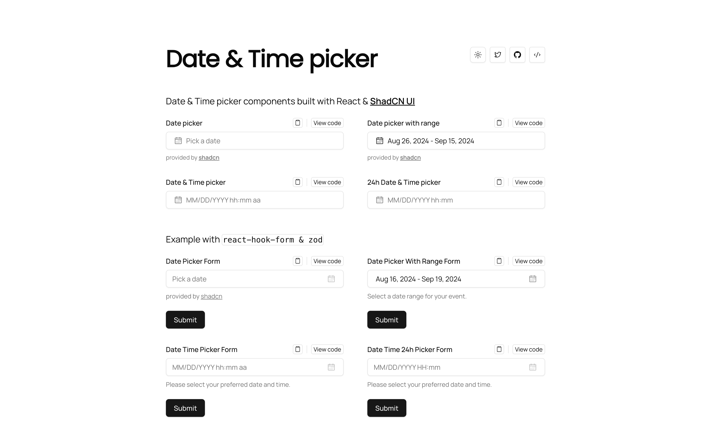
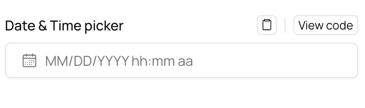

# ShadCN Date Time Picker



## Overview

The ShadCN Date Time Picker project features a range of Date and Time picker components built with ShadCN. These examples highlight the components' versatility and functionality across various use cases.

## How to Use

To get started, visit [time.rdsx.dev](https://time.rdsx.dev). You can click the `copy` button to copy the code or the `view code` button to see the code in detail.



## Examples

Check out the live examples of our Date and Time picker components:

- [Date Picker](https://time.rdsx.dev)
- [Date Picker Range](https://time.rdsx.dev)
- [Date-Time Picker (12h)](https://time.rdsx.dev)
- [Date-Time Picker](https://time.rdsx.dev)

See how these components work with `react-hook-form` and `zod`:

- [Date Picker Form](https://time.rdsx.dev)
- [Date Picker Range Form](https://time.rdsx.dev)
- [Date-Time Picker (12h) Form](https://time.rdsx.dev)
- [Date-Time Picker Form](https://time.rdsx.dev)

## Contributing

We welcome contributions! Follow the local setup instructions below to get started.

> [!NOTE]
> You can use your favorite JavaScript runtime and package manager. This project uses bun.

1. **Clone the repository:**

   ```sh
   git clone https://github.com/your-username/shadcn-date-time-picker.git
   cd shadcn-date-time-picker
   ```

2. **Install dependencies:**

   ```sh
   bun install
   ```

3. **Run the development server:**

   ```sh
   bun run dev
   ```

4. **Open your browser:**

   Go to `http://localhost:3000` to see the project in action.

You're all set!

## License

This project is licensed under the [MIT License](./LICENSE.md).
